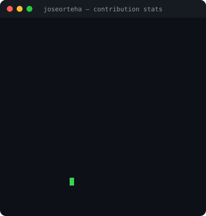

<!-- =====================================================================
  Perfil estilo terminal. Todo el movimiento vive dentro de SVGs porque
  GitHub elimina <script> y CSS del README, pero SI renderiza SVGs (via
  ) y ejecuta sus animaciones. El heatmap y las stats se regeneran
  solos cada dia con .github/workflows/update-profile-art.yml
====================================================================== -->

<h3><code>jose@github ~ $ whoami</code></h3>

<!-- ===== HERO: retrato ASCII (anima al cargar) junto al nombre + bio ===== -->
<table>
<tr>
<td valign="middle" width="40%">

</td>
<td valign="middle" width="60%" align="left">

<h1>José Ortega</h1>

<b>⚡ Desarrollador de Software · Web · Mobile · IA</b>

Desarrollador de software de <b>Zongolica, Veracruz</b>. Curso el 9.º semestre de
Ingeniería en Sistemas Computacionales y trabajo como <b>desarrollador web en el
H. Ayuntamiento de Zongolica</b>, construyendo soluciones reales para mi región.

Me gusta llevar una idea de principio a fin —web, móvil, backend, bases de datos e
<b>inteligencia artificial</b>— y usar la tecnología para resolver problemas de mi
comunidad. Aprendo, construyo y compito, siempre buscando el siguiente reto.

</td>
</tr>
</table>

 

<h3><code>jose@github ~ $ ls ./proyectos</code></h3>

📍 <b><a href="https://github.com/joseorteha/LocalizaT">LocalizaT</a></b> — Plataforma comunitaria que conecta a quien perdió un objeto con quien lo encontró. Usa <b>IA</b> para comparar características, descripciones, lugares y fechas y proponer posibles coincidencias. 
🤖 <b><a href="https://agroasistente.joseortega.lat/">AgroAsistente</a></b> — Consultor agrónomo virtual con <b>IA</b> para pequeños y medianos productores de café y cultivos de ladera.

 

<h3><code>jose@github ~ $ cat stack.txt</code></h3>

<table>
<tr>
<td align="right"><b>Frontend</b></td>
<td>

</td>
</tr>
<tr>
<td align="right"><b>Backend</b></td>
<td>

</td>
</tr>
<tr>
<td align="right"><b>Data &amp; Infra</b></td>
<td>

</td>
</tr>
<tr>
<td align="right"><b>Mobile &amp; Tools</b></td>
<td>

</td>
</tr>
</table>

 

<h3><code>jose@github ~ $ cat logros.txt</code></h3>

🏆 Con el equipo <b>Siera Code</b> en el <b>Hackathon Innovatec</b> del <b>TecNM</b>:

🥉 <b>3.er lugar nacional</b> · Innovatec 2025 &nbsp;&nbsp;&nbsp; 🥇 <b>1.er lugar · etapa local</b> · Innovatec 2026

 
 

<!-- ===== bloque de actividad: stats + heatmap (datos reales, diarios) ===== -->

<h3><code>jose@github ~ $ ./stats.sh</code></h3>

 
 

<h3><code>jose@github ~ $ ./contributions.sh</code></h3>

 
 

<h3><code>jose@github ~ $ ./links.sh</code></h3>

 

<code>jose@github ~ $</code> <i>"Eres lo que amas."</i> <code>_</code>

 
 

