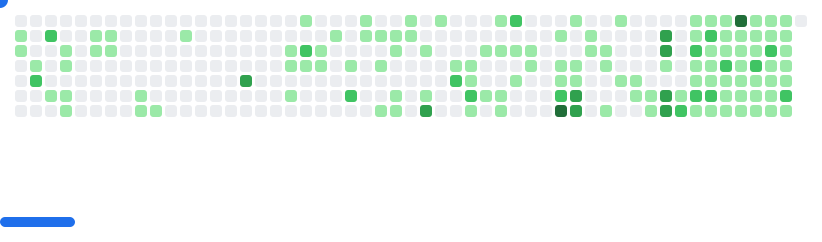

<!-- Banner principal -->

  

<h1 align="center">¡Hola, soy José Ortega! </h1>

<b>Desarrollador web, estudiante y entusiasta de la tecnología.</b>

"Hoy comienza una nueva etapa: ¡emprender, crear y compartir! Si puedes soñarlo, puedes programarlo."

---

## 🙋‍♂️ Sobre mí

¡Bienvenido a mi perfil! Soy estudiante en el <a href="https://zongolica.tecnm.mx/" target="_blank">Instituto Tecnológico Superior de Zongolica</a>, apasionado por el desarrollo web, el análisis de datos y las tecnologías emergentes. Me encanta aprender, crear proyectos y compartir conocimiento. En mi portafolio puedes conocer más sobre mi trayectoria, proyectos y certificaciones.

- 🌐 Portafolio: [jose-ortega-dev.netlify.app](https://www.joseortega.lat/)
- 📧 Contacto: [joseortegaha@gmail.com](mailto:joseortegaha@gmail.com)
- 💡 Filosofía: "Eres lo que amas."

---

## 🏆 Proyectos Destacados

### 🚀 Cyber Código

Mi emprendimiento más reciente es <a href="https://cybercodigo-seven.vercel.app/" target="_blank">Cyber Código</a>, una startup nacida en Zongolica, Veracruz, con la misión de llevar el talento local al mundo digital. Creamos páginas web de alto impacto para negocios y emprendedores, impulsando el crecimiento local con tecnología y diseño.

---

## 🛠️ Tecnologías y herramientas

###  Lenguajes

###  Frontend

###  Backend y bases de datos

###  Herramientas y diseño

---

## 🖥️ Sistemas operativos y virtualización

  <b>Experiencia trabajando con máquinas virtuales y entornos de servidores Linux.</b>

---

## 📈 Estadísticas y logros

<table>
<tr>
<td width="50%">
  
</td>
<td width="50%">
  
</td>
</tr>
</table>

  

---

## 🚀 GitHub Breakout

<picture>
  <source media="(prefers-color-scheme: dark)" srcset="output/dark.svg" />
  <source media="(prefers-color-scheme: light)" srcset="output/light.svg" />
  
</picture>

---

  

---

  <b>Créditos:</b> <a href="https://github.com/joseorteha">José Ortega</a>  
  <i>Última edición: 16/09/2025</i>

---

## 🌐 Redes sociales

  
  
  
  

---
